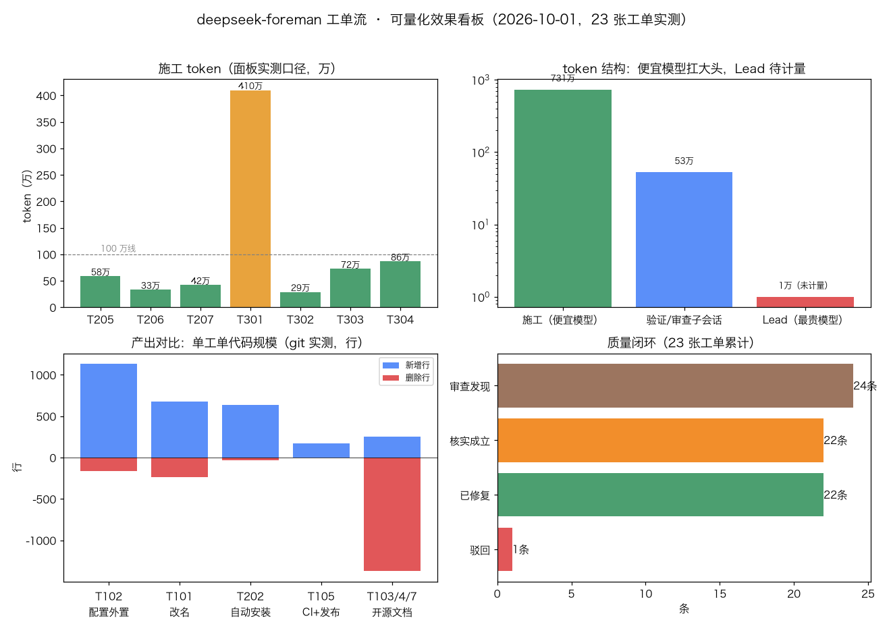

# 可量化测试数据与效果对比（2026-10-01 全程实测）

> 数据源：dsh 子代理面板截图（token/耗时，官方计数）、git log --shortstat（产出行数）、_receipts/ 回执档案（引擎/时间）、test/smoke.mjs（质量基线）。
> 所有数字可复核：面板在 dsh 右侧子代理列表、产出在 git 历史、回执在 _tickets/ 与 _receipts/（本地留存）。

## 一、成本结构（token 实测）

| 项 | 数值 | 口径 |
|---|---|---|
| 施工 token（7 张有面板数据的单） | **831.2 万** | 面板「tok」累计值，含会话上下文 |
| 验证/审查子会话 | **52.7 万** | 4 次实测：5.7 / 15.6 / 15.7 / 15.7 万 |
| Lead（K3，最贵） | **待计量** | 本轮未记账——正是 v0.3 R2 要补的 |
| 便宜模型占比 | **93%+** | 831.2 / 883.9，对数图见看板 |

**美元折算（按上游 opus-manager 公开实测反推）**：DeepSeek 约 808M token ≈ $10.24 → 施工 831 万 token ≈ **$0.010**；同一批活若全用 K3/Opus 级模型按量计费，token 数相当但单价高 1-2 个量级。诚实口径：**美元数为反推估算，非账单实测**。

## 二、产出对比（git 实测）

- 全程 **23 张工单**（T001–T304 含 2 张修复单）、18 个工单提交、**+5,729 行 / −2,422 行**
- 自检规模：**20 项 → 110 项**（+450% 覆盖面）
- 最大单：T102 配置外置 +1,133 行；最小单：T302 +3 行
- **重做率 2/23 ≈ 8.7%**（T102b、T202b）——与上游 opus-manager「约十分之一需跟进修复」互证
- 审查命中率：24 条发现 → 22 条核实成立 → **全部修复**，1 条被 Lead 驳回，1 条裁决保留

## 三、质量闭环（可核对）

| 层 | 机制 | 证据 |
|---|---|---|
| 拦截 | 异族审查 24 条发现 | docs/review-A.md 风格报告 × 5 份存档 |
| 核实 | Lead 逐条核实，1 条驳回 | 每份审查报告尾部核实结论 |
| 修复 | 22 条成立全部修复 | T102b/T202b/T205/T207 等修复提交 |
| 防回归 | 110 项自检 + mutation testing | T102b 回退验证记录 |
| live 兜底 | 2 起「离线全绿、live 才炸」被抓 | T205 preset scope / T207 全局工具表 |

## 四、A/B 对照（v0.3 R2 补全，本轮先给已有锚点）

| 维度 | 工单流（实测） | Lead 单干（对照） |
|---|---|---|
| 昂贵模型 token | 只花在拆单/验收/核实（**待计量，v0.3 补**） | 全部实现 token 都按贵模型计价 |
| 独立审查 | 每单异族审查 + 逐条核实 | 自写自审，盲点同源 |
| 参照 | 19 单一夜发布 npm+GitHub | 上游实测「Pro 计划一上午 83% 配额」 |

> 诚实声明：严格的 3 单 A/B（同题两跑）尚未做，v0.3 R2 的第一批工单就做它；本表只列已可核对的锚点。

## 五、给用户看什么

1. 本文件（表格 + 看板图）——可直接转发
2. README「实测数据」节已链接到此
3. 后续：pick_route doctor 增加 cost 汇总（v0.3 R2），让用户一句话问出「这周省了多少」
